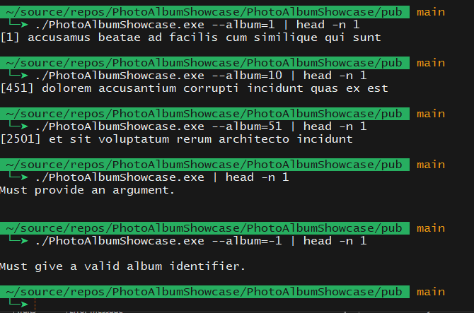
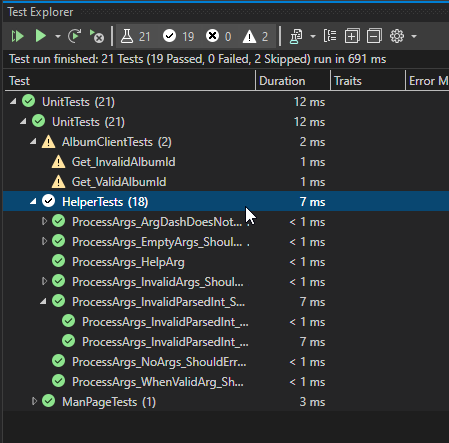

# Description
## What

A console app that calls a mock api and returns the results.

## Why

This is a showcase for a prospective employer.

## How

.NET 6 console app that uses a simple HttpClient to call the mock API.

It uses Xunit and Shouldly for unit testing.

# Operation
## Running

Command-line operation is best.  Examples via Bash for Windows.

`./PhotoAlbumShowcase.exe --album=1`
`./PhotoAlbumShowcase.exe --help`

## Testing

Basic unit testing is included suitable for a poc showcase is included.

